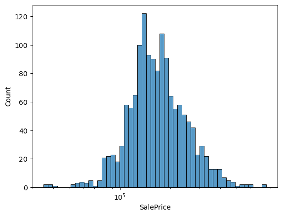
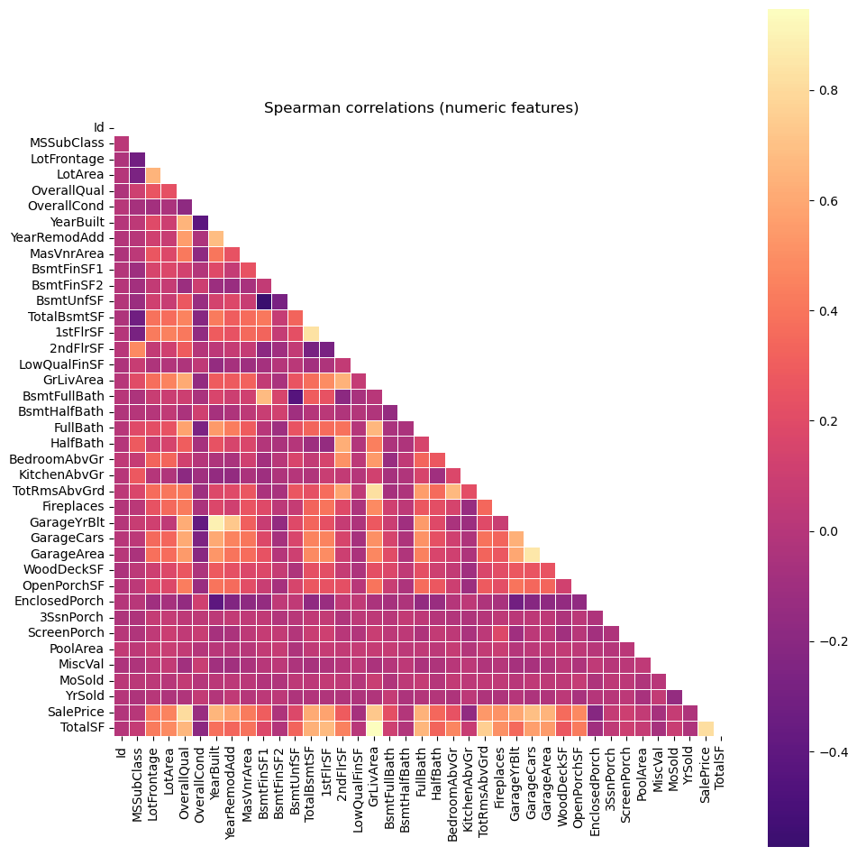
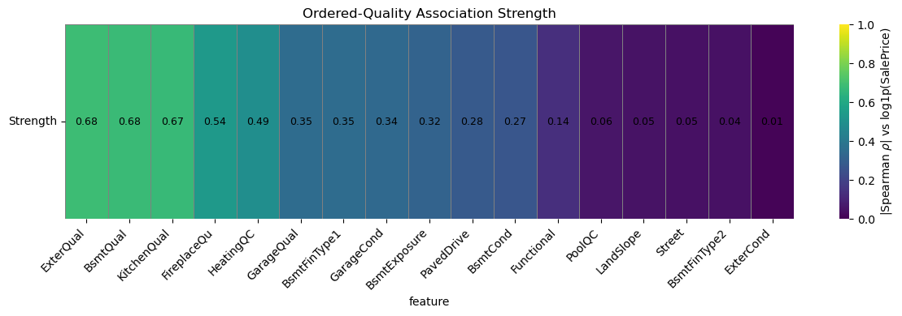
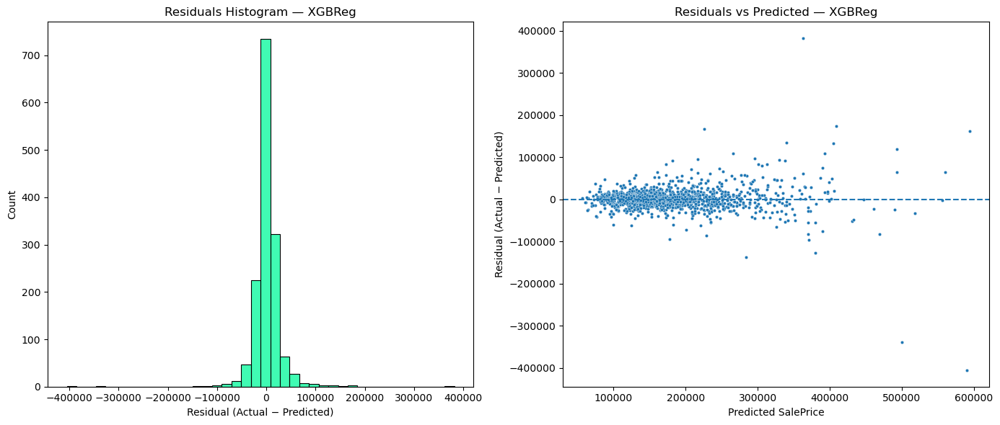
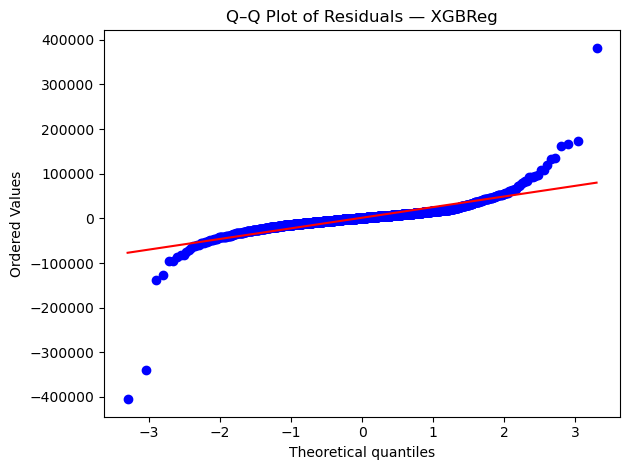
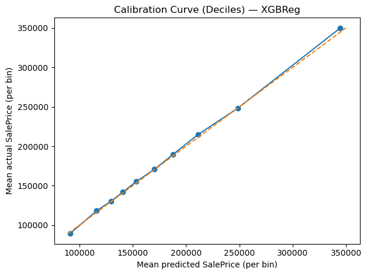
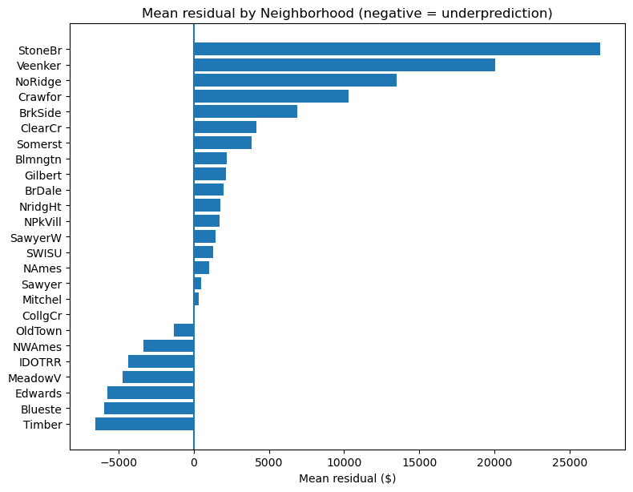

# Ames House Prices — End-to-End ML (EDA → Model → Submission)

> A concise, reproducible notebook for the Kaggle **House Prices: Advanced Regression Techniques** dataset.  
> Focus: fundamentals, disciplined validation, and a well-calibrated tabular model.

## TLDR;

- **Goal:** Predict sale price from residential house attributes in Ames, Iowa.  
- **Data:** Kaggle train/test CSVs (~1.5k train rows, 79 features).  
- **Highlights:**
  - Clear EDA (numeric + ordinal correlations, outliers, group effects)
  - Engineered feature: **`TotalSF = TotalBsmtSF + 1stFlrSF + 2ndFlrSF`**
  - **Fold-wise Target Encoding** for `Neighborhood` with smoothing
  - Model family comparison (Ridge/Lasso, HistGradientBoosting, LightGBM, **XGBoost**)
  - **Early stopping** + light randomized tuning
  - Strong **calibration** across the price range; reproducible sklearn pipeline

---

## EDA summary

**Target shape.** `SalePrice` is right-skewed; the model uses **log₁₊(SalePrice)** to reduce skew and stabilize variance.

**Correlations.**
- **Pearson (numeric vs log target):** size/capacity dominate — **`TotalSF`** (engineered), `GrLivArea`, `GarageCars`, baths.  
- **Spearman (ordinals):** `OverallQual` strongest; `KitchenQual`, `ExterQual`, `BsmtQual` are monotonic with price.

**Group effects.** `Neighborhood` shows systematic differences; handled via **fold-wise Target Encoding** and evaluated with **mean residual by neighborhood** on out-of-fold (OOF) predictions.

> **np.log1p SalePrice**  
>   
>   
> 

---

## Feature engineering & preprocessing

- **Engineered:** `TotalSF = TotalBsmtSF + 1stFlrSF + 2ndFlrSF` (no target leakage).  
- **Ordinal qualities:** mapped to ordered integers (`Po < Fa < TA < Gd < Ex`, etc.).  
- **Categoricals:**
  - `Neighborhood` → **Target Encoding** (fold-wise, smoothed).  
  - Remaining nominals → **One-Hot Encoding**.
- **Numerics:** median impute + standardize.  
- All transforms live **inside** a single sklearn **Pipeline** to keep train/test consistent and avoid leakage.

---

## Validation protocol & diagnostics

- **KFold(5, shuffle, random_state=42)**; same folds across models.  
- Preprocessing (incl. target encoding) is fit **within the fold**.  
- **Metric:** RMSE on the **original dollar** scale (model trains on log target via `TransformedTargetRegressor` and predicts back with `expm1`).  
- Diagnostics on **OOF** predictions: residuals vs predicted, Q–Q, decile **calibration**, and **mean residual by Neighborhood**.

 
>   
>   
>   
> 

---

## 🤖 Model selection (summary)

- Compared Ridge/Lasso, HistGradientBoosting, LightGBM, and **XGBoost** with identical preprocessing and folds.  
- **XGBoost** achieved the best mean CV RMSE (tight fold std) and near-perfect decile calibration.  
- Boosters used **early stopping** per fold to choose effective rounds; a light **RandomizedSearchCV** refined learning rate/depth/regularization.

**Decision:** proceed with **XGBoost** + the shared preprocessing (ordinals, `TotalSF`, TE[`Neighborhood`]) wrapped in `TransformedTargetRegressor`.

---

`requirements.txt` (minimal):

```
pandas
numpy
scikit-learn
xgboost
joblib
matplotlib
seaborn
```

---

## Calibration & fairness notes

- Decile calibration sits close to the 45° line → no post-hoc calibration needed.  
- Neighborhood bias reduced via **fold-wise** target encoding; remaining large deviations are mostly **small-n** neighborhoods and are controlled via smoothing.

---

## Limitations & extensions

- Add **nested CV** for an unbiased estimate of the tuning procedure.  
- Try **CatBoost** (native categorical handling) or a simple **stacked blend** (e.g., XGB + HistGB).  
- If decile curves bow on a different dataset, consider a light **post-hoc linear calibrator** on OOF predictions.

